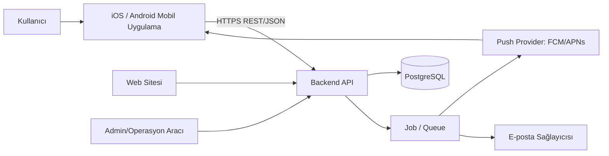
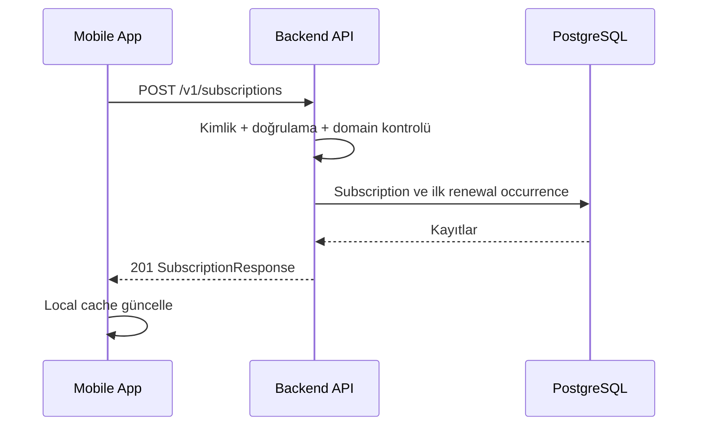
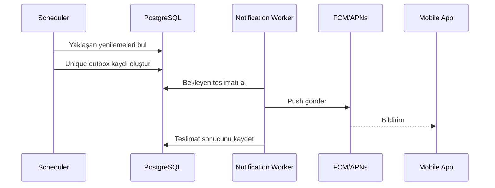

# Sistem Mimarisi

## 1. Amaç

Bu doküman SubscriptTrack'in mobil istemci, backend, veritabanı, bildirim altyapısı ve web sitesinden oluşan üst düzey mimarisini tanımlar.

## 2. Mimari ilkeler

- **Domain-first:** Kod yapısı iş kavramlarını takip eder.
- **Contract-first:** Mobil istemci ve backend, sürümlü API sözleşmesine bağlıdır.
- **Vertical slice:** Özellikler ekran, API, iş kuralı, veri ve testleriyle uçtan uca tamamlanır.
- **Backend kaynaklı gerçek:** Bulut verisi ana kaynaktır; mobil veritabanı cache ve çevrimdışı okuma katmanıdır.
- **Güvenli varsayılan:** Kullanıcı izolasyonu, doğrulama ve yetki kontrolü backend'de uygulanır.
- **Idempotent işlemler:** Bildirim ve kritik yazma işlemleri tekrar çalıştırıldığında çift kayıt üretmemelidir.

## 3. Sistem bağlamı



Kaynak Mermaid dosyası: `docs/diagrams/system-context.mmd`.

## 4. Bileşenler

### 4.1 Mobil uygulama

Sorumluluklar:

- Kimlik doğrulama kullanıcı deneyimi
- Abonelikleri listeleme ve düzenleme
- Dashboard ve takvim sunumu
- Yerel cache
- Deep link ve push yönetimi
- Tema, dil ve erişilebilirlik
- Ağ ve senkronizasyon durumunu gösterme

Mobil uygulama güvenlik veya sahiplik kararının tek uygulayıcısı değildir.

### 4.2 Backend API

Sorumluluklar:

- Token doğrulama
- Kullanıcı/veri sahipliği
- Domain kuralları
- Abonelik CRUD ve durum geçişleri
- Dashboard toplamları
- Yenileme olaylarının oluşturulması
- Bildirim planlama ve teslimat kayıtları
- Tasarruf olayları
- Hesap silme ve veri dışa aktarma

### 4.3 PostgreSQL

- İlişkisel ana veri kaynağı
- UUID kimlikler
- Parada `NUMERIC/DECIMAL`
- Zaman damgalarında UTC `TIMESTAMPTZ`
- Audit ve teslimat kayıtları
- Unique constraint'lerle tekrar engelleme

### 4.4 Job ve bildirim katmanı

Önerilen yapı:

```text
Renewal generator
→ notification outbox
→ channel worker
→ provider
→ delivery result
```

Cron yalnızca doğrudan e-posta gönderen tek parça bir işlem olmamalıdır. İşler kayıt altına alınmalı ve kontrollü tekrar denenmelidir.

### 4.5 Web sitesi

İlk kapsam:

- Landing page
- Özellikler ve fiyatlandırma
- Yardım merkezi
- Gizlilik ve kullanım koşulları
- Servis/iptal rehberleri
- Hesap ve veri silme açıklamaları
- App Store / Google Play yönlendirmeleri

Tam web dashboard kapsam dışıdır; abonelik yönetimi iOS ve Android mobil uygulamasında yapılır. Web sitesi yalnızca tanıtım, yardım, iptal rehberleri ve yasal sayfalar içindir.

## 5. Veri akışları

### Abonelik ekleme



### Bildirim teslimatı



## 6. API sınırı

- HTTPS zorunlu
- JSON istek/yanıt
- `/v1` sürüm öneki
- OAuth/JWT Bearer token
- ISO 8601 tarih-zaman
- ISO 4217 para birimi kodu
- Para değerleri JSON'da string olarak taşınır
- Standart hata zarfı kullanılır

## 7. Cache ve offline yaklaşımı

MVP önerisi:

- Son başarılı abonelik listesi ve dashboard özeti cihazda saklanır.
- İnternet yokken kullanıcı son veriyi görebilir.
- Yazma işlemi için bağlantı gerekir; form verisi başarısızlıkta kaybolmaz.
- Daha sonra outbox tabanlı offline yazma değerlendirilebilir.

## 8. Ölçeklenebilirlik

Başlangıçta modüler monolith önerilir:

```text
Auth
Profile
Subscription
Renewal
Notification
Savings
Catalog
```

Mikroservis erken aşamada önerilmez. Bildirim worker'ı ayrı süreç olabilir ancak aynı kod tabanını paylaşabilir.

## 9. Gözlemlenebilirlik

- Yapılandırılmış log
- Correlation/request ID
- Hata izleme
- Push/e-posta teslimat metrikleri
- Job gecikmesi ve başarısızlık alarmı
- API latency ve hata oranı
- Hassas değerleri maskeleme

## 10. Deployment ortamları

- `local`
- `development`
- `staging`
- `production`

Her ortam ayrı veritabanı, secret ve push/e-posta yapılandırması kullanmalıdır.

## 11. Karar bekleyen noktalar

- Mobil framework
- Backend framework/hosting
- Auth sağlayıcısı
- Queue/job çözümü
- E-posta sağlayıcısı
- Analytics ve crash reporting

Bu kararlar ADR ile kaydedilmelidir.
