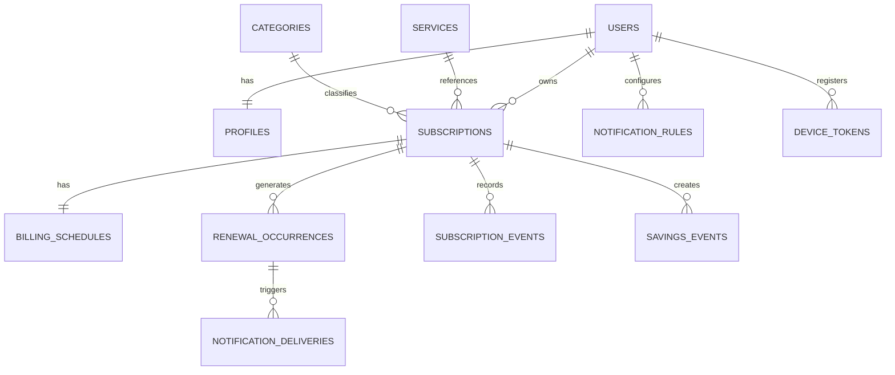

# Veri Modeli

## 1. Genel ilkeler

- PostgreSQL referans alınır.
- Kimlikler UUID'dir.
- Para değerleri `NUMERIC(19,4)` olarak saklanır.
- Para birimleri `CHAR(3)` ISO 4217 kodudur.
- Tarih-zaman alanları UTC `TIMESTAMPTZ` olarak saklanır.
- Kullanıcı verileri `user_id` üzerinden izole edilir.
- Normal kullanıcı akışında soft delete/arşiv yaklaşımı kullanılır.

## 2. İlişki özeti



## 3. Tablolar

### 3.1 `users`

Kimlik sağlayıcısının kullanıcı kaydı. Harici auth kullanılıyorsa uygulama veritabanında minimum temsil tutulabilir.

| Alan | Tip | Kural |
|---|---|---|
| `id` | UUID | PK |
| `email` | CITEXT | unique, nullable auth modeline göre |
| `status` | VARCHAR | ACTIVE, DELETION_PENDING, DELETED |
| `created_at` | TIMESTAMPTZ | not null |
| `updated_at` | TIMESTAMPTZ | not null |

### 3.2 `profiles`

| Alan | Tip | Kural |
|---|---|---|
| `user_id` | UUID | PK/FK users |
| `first_name` | VARCHAR(100) | nullable |
| `last_name` | VARCHAR(100) | nullable |
| `preferred_currency` | CHAR(3) | not null |
| `timezone` | VARCHAR(64) | IANA zone; ör. Europe/Istanbul |
| `locale` | VARCHAR(16) | ör. tr-TR |
| `theme` | VARCHAR(16) | SYSTEM/LIGHT/DARK |
| `default_notify_days` | SMALLINT | 1–30 |
| `push_enabled` | BOOLEAN | not null |
| `in_app_enabled` | BOOLEAN | not null |
| `email_enabled` | BOOLEAN | not null |

Auth kullanıcısı oluşturulduğunda `handle_new_user_profile` tetikleyicisi yalnızca
`user_id` ile profil satırını oluşturur. Kayıt ekranındaki görünen ad,
`auth.users.raw_user_meta_data.display_name` içinde tutulur; `profiles` tablosunda
`display_name` alanı yoktur.

### 3.3 `services`

| Alan | Tip | Kural |
|---|---|---|
| `id` | UUID | PK |
| `slug` | VARCHAR(120) | unique |
| `name` | VARCHAR(160) | not null |
| `logo_url` | TEXT | nullable |
| `website_url` | TEXT | nullable |
| `account_url` | TEXT | nullable |
| `cancellation_url` | TEXT | nullable |
| `category_id` | UUID | nullable FK |
| `last_verified_at` | TIMESTAMPTZ | nullable |
| `is_active` | BOOLEAN | not null |

### 3.4 `categories`

| Alan | Tip | Kural |
|---|---|---|
| `id` | UUID | PK |
| `code` | VARCHAR(32) | unique |
| `display_name_key` | VARCHAR(100) | localization key |
| `icon_key` | VARCHAR(64) | not null |
| `sort_order` | SMALLINT | not null |
| `is_system` | BOOLEAN | not null |

Renk, mobil design token üzerinden belirlenir; DB'de ham hex saklanması önerilmez.

### 3.5 `subscriptions`

| Alan | Tip | Kural |
|---|---|---|
| `id` | UUID | PK |
| `user_id` | UUID | FK, not null |
| `service_id` | UUID | nullable FK |
| `category_id` | UUID | FK, not null |
| `name` | VARCHAR(160) | not null |
| `status` | VARCHAR(24) | not null |
| `website_url` | TEXT | nullable |
| `account_url` | TEXT | nullable |
| `cancellation_url` | TEXT | nullable |
| `note` | TEXT | nullable, uzunluk limiti |
| `payment_method_label` | VARCHAR(80) | nullable |
| `trial_end_at` | TIMESTAMPTZ | nullable |
| `regular_amount` | NUMERIC(19,4) | nullable |
| `cancelled_at` | TIMESTAMPTZ | nullable |
| `access_ends_at` | TIMESTAMPTZ | nullable |
| `archived_at` | TIMESTAMPTZ | nullable |
| `created_at` | TIMESTAMPTZ | not null |
| `updated_at` | TIMESTAMPTZ | not null |

Index:

- `(user_id, status)`
- `(user_id, updated_at desc)`
- `(user_id, category_id)`

### 3.6 `billing_schedules`

| Alan | Tip | Kural |
|---|---|---|
| `subscription_id` | UUID | PK/FK |
| `amount` | NUMERIC(19,4) | not null |
| `currency` | CHAR(3) | not null |
| `cycle` | VARCHAR(24) | not null |
| `interval_count` | INTEGER | custom cycle için |
| `next_renewal_at` | TIMESTAMPTZ | nullable duruma göre |
| `anchor_day` | SMALLINT | ay sonu niyeti için nullable |
| `timezone` | VARCHAR(64) | not null |

### 3.7 `renewal_occurrences`

| Alan | Tip | Kural |
|---|---|---|
| `id` | UUID | PK |
| `subscription_id` | UUID | FK |
| `user_id` | UUID | sahiplik sorgusu için |
| `scheduled_at` | TIMESTAMPTZ | not null |
| `expected_amount` | NUMERIC(19,4) | not null |
| `currency` | CHAR(3) | not null |
| `type` | VARCHAR(24) | RENEWAL/TRIAL_END |
| `status` | VARCHAR(24) | PLANNED/CONFIRMED/SKIPPED/CANCELLED |
| `created_at` | TIMESTAMPTZ | not null |

Unique önerisi:

```text
(subscription_id, scheduled_at, type)
```

### 3.8 `notification_rules`

| Alan | Tip | Kural |
|---|---|---|
| `id` | UUID | PK |
| `user_id` | UUID | FK |
| `subscription_id` | UUID | nullable; null ise varsayılan |
| `event_type` | VARCHAR(32) | RENEWAL/TRIAL_END/... |
| `channel` | VARCHAR(16) | PUSH/IN_APP/EMAIL |
| `days_before` | SMALLINT | 0–30 |
| `local_time` | TIME | nullable; ör. 09:00 |
| `enabled` | BOOLEAN | not null |

### 3.9 `notifications`

Uygulama içi kalıcı bildirim.

| Alan | Tip | Kural |
|---|---|---|
| `id` | UUID | PK |
| `user_id` | UUID | FK |
| `subscription_id` | UUID | nullable FK |
| `occurrence_id` | UUID | nullable FK |
| `type` | VARCHAR(32) | not null |
| `title_key` | VARCHAR(120) | not null |
| `body_params` | JSONB | not null |
| `deep_link` | TEXT | nullable |
| `read_at` | TIMESTAMPTZ | nullable |
| `created_at` | TIMESTAMPTZ | not null |

### 3.10 `notification_deliveries`

| Alan | Tip | Kural |
|---|---|---|
| `id` | UUID | PK |
| `user_id` | UUID | FK |
| `occurrence_id` | UUID | FK |
| `channel` | VARCHAR(16) | PUSH/EMAIL |
| `notification_type` | VARCHAR(32) | not null |
| `status` | VARCHAR(24) | PENDING/SENT/FAILED/DEAD |
| `attempt_count` | INTEGER | default 0 |
| `provider_message_id` | VARCHAR(255) | nullable |
| `scheduled_for` | TIMESTAMPTZ | not null |
| `sent_at` | TIMESTAMPTZ | nullable |
| `last_error_code` | VARCHAR(100) | nullable |
| `created_at` | TIMESTAMPTZ | not null |

Unique:

```text
(occurrence_id, channel, notification_type)
```

### 3.11 `device_tokens`

| Alan | Tip | Kural |
|---|---|---|
| `id` | UUID | PK |
| `user_id` | UUID | FK |
| `platform` | VARCHAR(16) | IOS/ANDROID |
| `token_hash` | VARCHAR(128) | index için |
| `encrypted_token` | TEXT | sağlayıcı tokenı |
| `app_version` | VARCHAR(32) | nullable |
| `last_seen_at` | TIMESTAMPTZ | not null |
| `revoked_at` | TIMESTAMPTZ | nullable |

### 3.12 `subscription_events`

| Alan | Tip | Kural |
|---|---|---|
| `id` | UUID | PK |
| `subscription_id` | UUID | FK |
| `user_id` | UUID | FK |
| `event_type` | VARCHAR(32) | CREATED/PRICE_CHANGED/... |
| `old_values` | JSONB | nullable |
| `new_values` | JSONB | nullable |
| `occurred_at` | TIMESTAMPTZ | not null |

### 3.13 `savings_events`

| Alan | Tip | Kural |
|---|---|---|
| `id` | UUID | PK |
| `subscription_id` | UUID | FK |
| `user_id` | UUID | FK |
| `event_type` | VARCHAR(24) | CANCELLED/DOWNGRADED/PAUSED |
| `monthly_amount` | NUMERIC(19,4) | not null |
| `annual_amount` | NUMERIC(19,4) | not null |
| `currency` | CHAR(3) | not null |
| `effective_at` | TIMESTAMPTZ | not null |

## 4. Silme ve saklama

- Kullanıcı arşivleme işlemi fiziksel silme yapmaz.
- Hesap silme ayrı workflow ile bütün kullanıcı verisini kapsar.
- Yasal/operasyonel saklama gerekiyorsa süreler `SECURITY.md` ve gizlilik politikasında açıkça belirtilir.

## 5. Migration kuralları

- Migration geri alınabilir veya güvenli ileri düzeltme içerir.
- Production'da destructive değişiklik tek adımda yapılmaz.
- Enum yerine kontrollü string/check constraint tercih edilebilir.
- Yeni not-null alan önce nullable eklenir, veri doldurulur, sonra constraint uygulanır.
